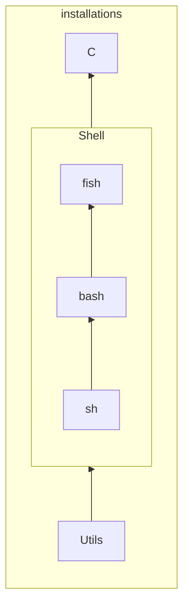

# My dot-files

## Install
```bash
sudo zypper in bash curl; curl -L https://raw.githubusercontent.com/sebhajek/dotfiles/main/get.sh | bash;
```

### Makefile dependencies



### Dictionary

- https://github.com/tvondra/ispell_czech

## Color-scheme

Inspirations:

- https://github.com/ishan9299/modus-theme-vim
- https://github.com/bluz71/vim-moonfly-colors
- https://github.com/nyoom-engineering/oxocarbon.nvim
- https://github.com/0xstepit/flow.nvim
- https://github.com/navarasu/onedark.nvim
- https://github.com/kyoz/purify
- https://github.com/liuchengxu/space-vim-dark
- https://github.com/djjcast/mirodark
- https://github.com/cwshugg/dwarrowdelf
